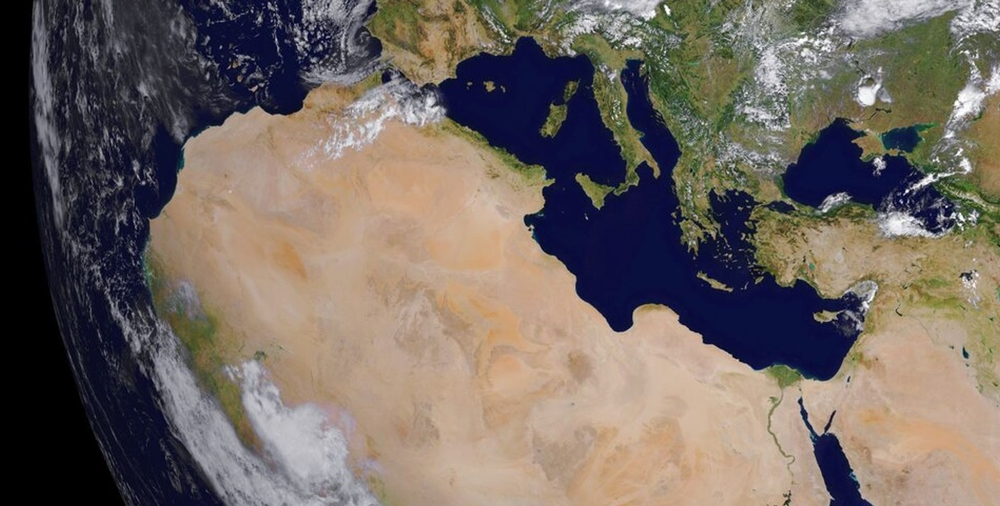
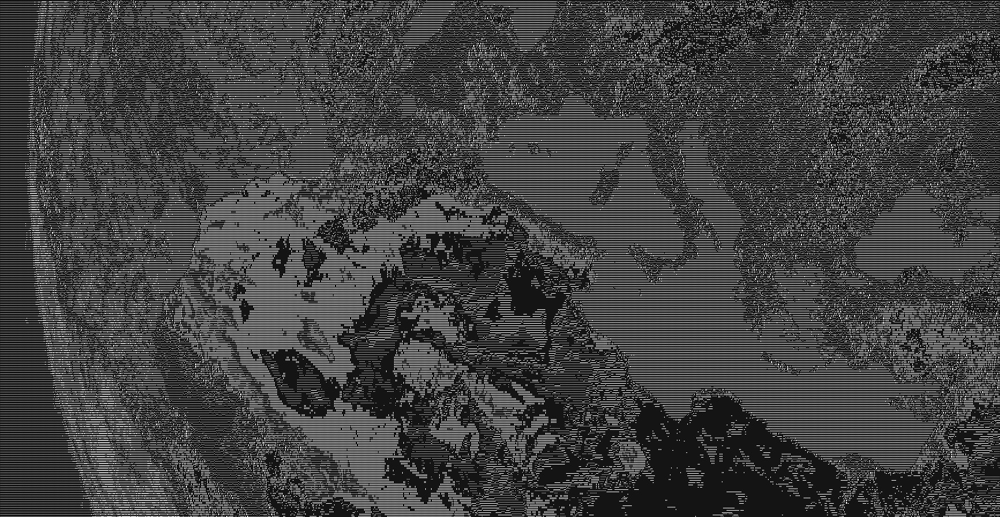

# ASCII-IMAGES

Image to ASCII text convertor. The `/images` folder contains some test images.

#### before:



#### after:


## run:

```bash
# compile
cargo build

# example execution
ascii-images.exe --in images/image1.png --out output.txt
```

## usage:

```bash
USAGE:
    ascii-images.exe [OPTIONS] --in <IN>

OPTIONS:
        --charset <CHARSET>            The used set of characters for image generation (1 = more
                                       characters, better detail, less contrast; 2 = less
                                       characters, worse detail, more contrast) [default: 1]
        --compression <COMPRESSION>    The ammount of horizontal pixels that get compressed into one
                                       character of the result (the greater the value, the smaller
                                       the image) [default: 15]
    -h, --help                         Print help information
    -i, --in <IN>                      Path to the input file
    -o, --out <OUT>                    Path to the output (txt) file. If none specified, the output
                                       is dumped into stdout. [optional]
```

## characters:

The program offers two charsets for the output image.

1. the longer character ramp (black -> white)
   - this one creates images with more detail but less contrast

```
$@b%8&wm#\*oahkbdpqwmzo0qlcjuyxzcvunxrjft/\|()1{}[]?-\_+~<>i!li;:,"^`'.
```

2. the shorter character ramp (black -> white)
   - this one creates images with less detail but more contrast

```
@%#*+=-:.
```
